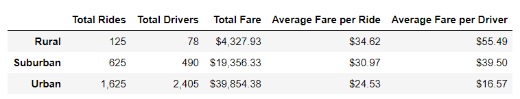
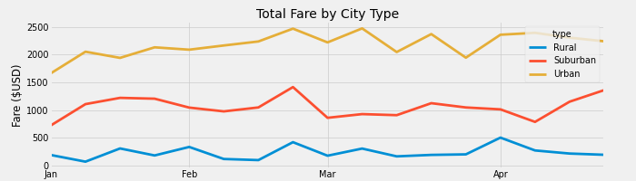

# PyBer Analysis

## Overview

In this project, our firm was asked to analyze ride-sharing data by city type. After breaking data into rural, suburban, and urban categories, we plotted weekly fares on a line graph to see trends over time. After our analysis was complete, we compiled this report for review.

## Results

Here are the differences between each city:

* Urban Data: 
  * highest number of rides and drivers
  * lowest average fare per ride & per driver
  * .67 rides to drivers ratio (1625 rides : 2405 drivers)
  * highest total fares

* Suburban Data: 
  * fewer rides & drivers compared to urban cities
  * 1.28 rides to drivers ratio (625 rides : 490 drivers)
  * higher than average fare per ride & per driver 
  * total fares lower (50% of urban total)

* Rural Data: 
  * lowest number of rides and drivers. 
  * highest average fare per ride and per driver
  * 1.6 rides to drivers ratio (125 rides : 78 drivers)
  * lowest total fares (~11% of urban total)

Detailed Analysis provided in these images:

## Summary

Disparities exist across city types based on a wide variety of factors. Three recomendations:
1. First, the company should consider whether it is worthwhile to maintain a rural presence. The low usage and small number of drivers potentially require some significant efforts to correct. Rural drivers are more likely to have their own cars, additionally drives are more likely to be for longer distances and times. Drivers are also likely needing to wait a long time, and potentially drive a long way just to get a rider. Without additional cost data, we cannot say how profitible rural rides are. Additional analysis may be needed to assess the value of this city group.
1. Next, the company should seek to balance the availability of drivers between urban and suburban populations. Urban cities have 2.6x the total rides than suburban cities, yet they have 4.9x the total drivers. The suburban rides to driver ratio is 1.6, but the urban ratio is .67. This means that many urban drivers have less than 1 ride per week. This is potentially an unsubstainable model, with too many unprofessional drivers. Further assessment should be done to identify trends based on driver ride amount. It is possible that drivers with more rides per week would also have higher customer services scores, and could also be more profitable altogether with fewer overhead costs to maintain (compared with maintianing multiple low-frequency drivers). Additional analysis should be done to identify the ideal driver ratio for each city size.
1. Finally, the company should conduct surveys in each city type to understand what influences consumer behavior. It is possible that additional marketing, integration with other apps such as Google Maps, price-matching with taxi services, or other marketing efforts could increase ridership. Given the surplus drivers in urban areas, the infrastructure to support increased utilization is likely already there.
